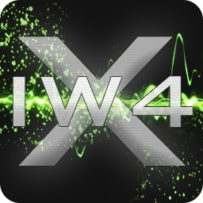
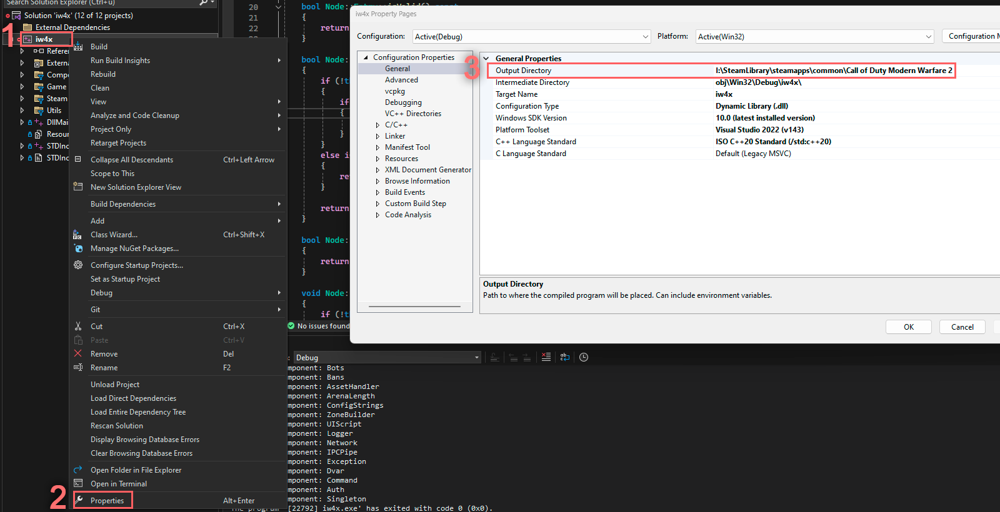
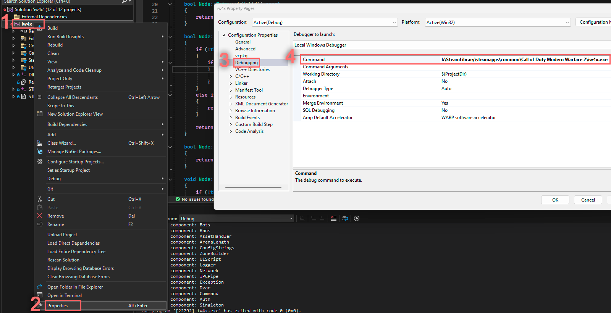

[](https://github.com/iw4x/iw4x-client/actions)

# IW4x: Client



IW4x is a community-driven project that aims to revitalize and enhance the [Call of Duty: Modern Warfare 2 (2009)](https://store.steampowered.com/app/10180/Call_of_Duty_Modern_Warfare_2_2009/) multiplayer experience by providing a stable platform with support for dedicated servers and modding.

A [__Steam__](https://store.steampowered.com/app/10180/Call_of_Duty_Modern_Warfare_2_2009/) installation of Modern Warfare 2 is required to run IW4x, copies from the Microsoft Store are **not compatible**.

IW4x is distributed through the [IW4x Launcher](https://github.com/iw4x/launcher).

## Compiling from Source

> [!IMPORTANT]
> **Clone** the git repository instead of downloading the ZIP, as the latter will not work.

1. Clone the repository - `git clone https://github.com/iw4x/iw4x-client.git`
2. Run `generate.bat` to initialize and update submodules and generate the Visual Studio solution
3. Open/build the generated solution file `build\iw4x.sln` with Visual Studio

To use the `iw4x.dll`, you must have a valid Modern Warfare 2 installation with the [IW4x Rawfiles](https://github.com/iw4x/iw4x-rawfiles) installed.

<details>
<summary>Development Setup</summary>

### Build to MW2 Directory

1. Right-click the IW4x solution in Visual Studio
2. Select Properties
3. Set the output directory to your MW2 install path



### Setup Debugger

1. Right-click the IW4x solution in Visual Studio
2. Select Properties
3. Select Debugging
4. Set the Command value to the path of your `iw4x.exe` inside your MW2 game files

> Tip:
> - Switch to Windowed mode in-game, as breakpoints will lock the window.
> - Pressing `F5` will launch the game and attach the debugger.
> - The default hotkey for stopping the debugger is `Shift+F5`.


</details>

## Premake arguments

| Argument                    | Description                                    |
|:----------------------------|:-----------------------------------------------|
| `--copy-to=PATH`            | Optional, copy the DLL to a custom folder after build, define the path here if wanted. |
| `--copy-pdb`                | Copy debug information for binaries as well to the path given via --copy-to. |
| `--disable-binary-check`    | Do not perform integrity checks on the exe. |
| `--sentry-dsn=URL`          | Submit crash reports to this Sentry DSN. Crash reporting is compiled out when it is not given. |

## Command line arguments

| Argument                | Description                                    |
|:------------------------|:-----------------------------------------------|
| `-entries`              | Print to the console a list of every asset as they are loaded from zonefiles. |
| `-stdout`               | Redirect all logging output to the terminal iw4x is started from, or if there is none, creates a new terminal window to write log information in. |
| `-console`              | Allow the game to display its own separate interactive console window. |
| `-dedicated`            | Starts the game as a headless dedicated server. |
| `-dump`                 | Write info of loaded assets to the raw folder as they are being loaded. |
| `-nointro`              | Skip game's cinematic intro.                   |
| `-version`              | Print IW4x build info on startup.              |
| `-steam`                | Enable friends feature and other Steam integrations. |
| `-unprotect-dvars`      | Allow the server to modify saved/archive dvars. |
| `-zonebuilder`          | Start the interactive zonebuilder tool console instead of starting the game. |
| `-original-str-parsing` | (ZoneBuilder mode only) Parse .str files in the same manner as the CoD4 Mod Tools. |
| `-disable-notifies`     | Disable "Anti-CFG" checks |
| `-disable-mongoose`     | Disable Mongoose HTTP server |
| `-disable-rate-limit-check` | Disable RCon rate limit checks |
| `-disable-mod-unloading` | Disable automatic mod (fs_game) unloading when disconnecting |
| `-sentryfull`           | Capture full process memory in crash reports rather than the stack and its surroundings. |
| `-sentrystack`          | Capture only stack memory in crash reports. |
| `-sentrydebug`          | Print the crash reporter's own diagnostics to the console. |

## Crash reporting

Crash reports are submitted to [Sentry](https://sentry.io) through the
[Sentry Native SDK](https://docs.sentry.io/platforms/native/), using its
out-of-process `native` backend. Three binaries make up the client side of it:

| Binary             | Role                                                                      |
|:-------------------|:--------------------------------------------------------------------------|
| `iw4x.dll`         | Holds the SDK, the scope and the in-process crash handler.                 |
| `sentry-crash.exe` | Started at launch and parked until a crash. Writes the minidump against the crashed game from the outside and uploads it, so a corrupted heap or an exhausted stack cannot take the report down with it. |
| `sentry-wer.dll`   | Registered with Windows Error Reporting. Catches fail-fast exceptions, stack buffer overruns and heap corruption, none of which reach a top level exception filter. |

All three are published with each release and must be installed side by side.

### Enabling it in a development build

Crash reporting is compiled out unless a DSN is passed to premake, so it
is off by default and release builds take the DSN from a repository
secret. To point a local build at Sentry, copy the example configuration
and fill in the DSN:

```sh
cp sentry.bash.example sentry.bash
sh generate-linux.sh release
```

Note that `sentry.bash` is ignored by git and is picked up automatically
by `generate-linux.sh`, which passes the DSN on to premake and exports
the rest of the file so `sentry-cli` can upload debug symbols from the
same shell.

On Windows the same is done with a user script, which git ignores as well.
Create `user.bat` next to `generate.bat` containing:

```bat
@echo off
call generate.bat --sentry-dsn=https://...
```

## Disclaimer

This software has been created purely for the purposes of
academic research. It is not intended to be used to attack
other systems. Project maintainers are not responsible or
liable for misuse of the software. Use responsibly.
