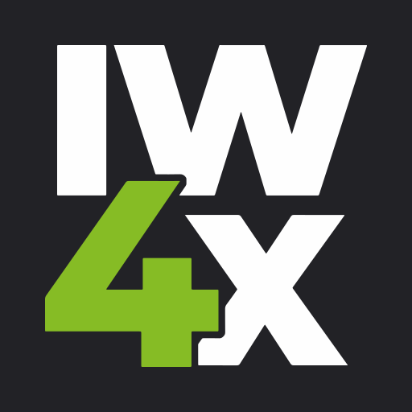

# IW4x: Client

IW4x is a community-driven project that aims to revitalize and enhance the [Call of Duty: Modern Warfare 2 (2009)](https://store.steampowered.com/app/10180/Call_of_Duty_Modern_Warfare_2_2009/) multiplayer experience by providing a stable platform with support for dedicated servers and modding.

IW4x is currently distributed through the [AlterWare Launcher](https://github.com/mxve/alterware-launcher).

## Compiling from Source

> [!IMPORTANT]
> **Clone** the git repository instead of downloading the ZIP, as the latter will not work.

1. Clone the repository - `git clone https://github.com/iw4x/iw4x-client.git`
2. Run `generate.bat` to initialize and update submodules and generate the Visual Studio solution
3. Open/build the generated solution file `build\iw4x.sln` with Visual Studio

To use the `iw4x.dll`, you must have a valid Modern Warfare 2 installation with the [IW4x Rawfiles](https://github.com/iw4x/iw4x-rawfiles) installed.

Development Setup

### Build to MW2 Directory

1. Right-click the IW4x solution in Visual Studio
2. Select Properties
3. Set the output directory to your MW2 install path

### Setup Debugger

1. Right-click the IW4x solution in Visual Studio
2. Select Properties
3. Select Debugging
4. Set the Command value to the path of your `iw4x.exe` inside your MW2 game files

> Tip:
> - Switch to Windowed mode in-game, as breakpoints will lock the window.
> - Pressing `F5` will launch the game and attach the debugger.
> - The default hotkey for stopping the debugger is `Shift+F5`.

## Premake arguments

| Argument                    | Description                                    |
|:----------------------------|:-----------------------------------------------|
| `--copy-to=PATH`            | Optional, copy the DLL to a custom folder after build, define the path here if wanted. |
| `--copy-pdb`                | Copy debug information for binaries as well to the path given via --copy-to. |
| `--force-unit-tests`        | Always compile unit tests.                     |
| `--disable-binary-check`    | Do not perform integrity checks on the exe. |

## Command line arguments

| Argument                | Description                                    |
|:------------------------|:-----------------------------------------------|
| `-tests`                | Perform unit tests.                            |
| `-entries`              | Print to the console a list of every asset as they are loaded from zonefiles. |
| `-stdout`               | Redirect all logging output to the terminal iw4x is started from, or if there is none, creates a new terminal window to write log information in. |
| `-console`              | Allow the game to display its own separate interactive console window. |
| `-dedicated`            | Starts the game as a headless dedicated server. |
| `-bigminidumps`         | Include all code sections from loaded modules in the dump. |
| `-reallybigminidumps`   | Include data sections from all loaded modules in the dump. |
| `-dump`                 | Write info of loaded assets to the raw folder as they are being loaded. |
| `-nointro`              | Skip game's cinematic intro.                   |
| `-version`              | Print IW4x build info on startup.              |
| `-nosteam`              | Disable friends feature and do not update Steam about the game's current status just like an invisible mode. |
| `-unprotect-dvars`      | Allow the server to modify saved/archive dvars. |
| `-zonebuilder`          | Start the interactive zonebuilder tool console instead of starting the game. |
| `-original-str-parsing` | (ZoneBuilder mode only) Parse .str files in the same manner as the CoD4 Mod Tools. |
| `-disable-notifies`     | Disable "Anti-CFG" checks |
| `-disable-mongoose`     | Disable Mongoose HTTP server |
| `-disable-rate-limit-check` | Disable RCon rate limit checks |

## Disclaimer

This software has been created purely for the purposes of
academic research. It is not intended to be used to attack
other systems. Project maintainers are not responsible or
liable for misuse of the software. Use responsibly.
